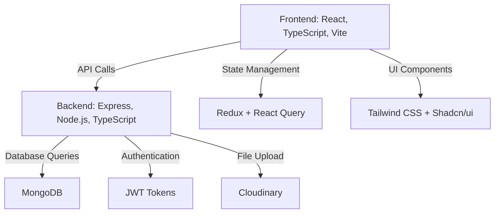

# FinalProject Documentation

## Table of Contents

1. [Project Overview](#project-overview)
2. [Architecture Diagram](#architecture-diagram)
3. [Technologies Used](#technologies-used)
4. [Setup & Installation](#setup--installation)
5. [Environment Variables](#environment-variables)
6. [Running the Application](#running-the-application)
7. [Project Structure](#project-structure)
8. [Core Features](#core-features)
9. [Backend Details](#backend-details)
10. [Frontend Details](#frontend-details)
11. [Data Models](#data-models)
12. [API Reference](#api-reference)
13. [User Guide](#user-guide)
14. [Testing](#testing)
15. [Deployment](#deployment)
16. [Troubleshooting](#troubleshooting)
17. [Contributing](#contributing)
18. [License](#license)

## Project Overview

FinalProject is a full-stack marketplace application for buying and selling code projects. It allows users to register, list their projects for sale, browse available products, purchase items from other sellers, and view seller information. The platform includes authentication, role-based access (user/admin), product management, purchase flows, reviews, and ratings.

### Key Features

- User authentication and authorization
- Product CRUD operations with ownership validation
- Secure purchase flow with self-purchase and duplicate prevention
- Seller information display on product pages
- Review and rating system
- Admin dashboard for management
- Responsive UI with modern design

## Architecture Diagram



## Technologies Used

### Backend

- **Node.js**: Runtime environment
- **Express.js**: Web framework for API
- **TypeScript**: Type-safe JavaScript
- **MongoDB**: NoSQL database
- **Mongoose**: ODM for MongoDB
- **JWT**: Authentication tokens
- **bcryptjs**: Password hashing
- **Cloudinary**: Image/file upload service
- **Nodemailer**: Email sending
- **Helmet, CORS, Rate Limiting**: Security middleware

### Frontend

- **React**: UI library
- **TypeScript**: Type safety
- **Vite**: Build tool and dev server
- **React Router**: Client-side routing
- **Redux Toolkit**: State management
- **React Query**: Data fetching and caching
- **Tailwind CSS**: Utility-first CSS framework
- **Shadcn/ui**: Component library
- **Axios**: HTTP client
- **React Hook Form**: Form handling

### Development Tools

- **ESLint**: Code linting
- **Prettier**: Code formatting
- **Husky**: Git hooks
- **Lint-staged**: Pre-commit linting

## Setup & Installation

### Prerequisites

- Node.js 18+ (download from [nodejs.org](https://nodejs.org/))
- npm or yarn package manager
- MongoDB (local installation or MongoDB Atlas)
- Git

### Installation Steps

1. **Clone the repository**

   ```bash
   git clone <repository-url>
   cd FinalProject
   ```

2. **Install backend dependencies**

   ```bash
   cd backend
   npm install
   ```

3. **Install frontend dependencies**

   ```bash
   cd ../frontend
   npm install
   ```

4. **Set up environment variables** (see [Environment Variables](#environment-variables) section)

5. **Start MongoDB**
   - For local MongoDB: Ensure MongoDB service is running
   - For MongoDB Atlas: Use connection string in environment variables

## Environment Variables

Create `.env` files in both `backend/` and `frontend/` directories.

### Backend (.env)

```env
NODE_ENV=development
PORT=5000
DATABASE_URL=mongodb://localhost:27017/finalproject
JWT_SECRET=your-super-secret-jwt-key
JWT_EXPIRE=30d
JWT_COOKIE_EXPIRE=30
CLOUDINARY_CLOUD_NAME=your-cloudinary-name
CLOUDINARY_API_KEY=your-cloudinary-api-key
CLOUDINARY_API_SECRET=your-cloudinary-api-secret
SMTP_HOST=smtp.gmail.com
SMTP_PORT=587
SMTP_EMAIL=your-email@gmail.com
SMTP_PASSWORD=your-app-password
FROM_EMAIL=noreply@yourapp.com
FROM_NAME=Your App Name
```

### Frontend (.env)

```env
VITE_API_URL=http://localhost:5000/api/v1
```

## Running the Application

### Development Mode

1. **Start the backend server**

   ```bash
   cd backend
   npm run dev
   ```

   Server will start on `http://localhost:5000`

2. **Start the frontend development server**
   ```bash
   cd frontend
   npm run dev
   ```
   App will be available at `http://localhost:5173`

### Production Build

1. **Build the frontend**

   ```bash
   cd frontend
   npm run build
   ```

2. **Start the backend in production**
   ```bash
   cd backend
   npm start
   ```

## Project Structure

```
FinalProject/
├── backend/
│   ├── src/
│   │   ├── app.ts                 # Express app configuration
│   │   ├── index.ts               # Server entry point
│   │   ├── config/
│   │   │   ├── db.ts              # Database connection
│   │   │   └── cloudinary.ts      # Cloudinary configuration
│   │   ├── controllers/
│   │   │   ├── authController.ts  # Authentication logic
│   │   │   ├── productController.ts # Product CRUD and purchase
│   │   │   ├── orderController.ts # Order management
│   │   │   ├── reviewController.ts # Review system
│   │   │   └── userController.ts  # User management
│   │   ├── middleware/
│   │   │   ├── auth.ts            # Authentication middleware
│   │   │   ├── error.ts           # Error handling
│   │   │   └── sanitize.ts        # Input sanitization
│   │   ├── models/
│   │   │   ├── User.ts            # User schema
│   │   │   ├── Product.ts         # Product schema
│   │   │   ├── Order.ts           # Order schema
│   │   │   └── Review.ts          # Review schema
│   │   ├── routes/
│   │   │   ├── authRoutes.ts      # Auth endpoints
│   │   │   ├── productRoutes.ts   # Product endpoints
│   │   │   ├── orderRoutes.ts     # Order endpoints
│   │   │   ├── userRoutes.ts      # User endpoints
│   │   │   └── index.ts           # Route aggregation
│   │   └── utils/
│   │       ├── ApiError.ts        # Custom error class
│   │       ├── asyncHandler.ts    # Async error wrapper
│   │       ├── sendEmail.ts       # Email utility
│   │       └── sendTokenResponse.ts # JWT response helper
│   ├── package.json
│   └── tsconfig.json
├── frontend/
│   ├── src/
│   │   ├── App.tsx                # Main app component
│   │   ├── main.tsx               # App entry point
│   │   ├── components/
│   │   │   ├── ui/                # Reusable UI components
│   │   │   └── ...                # Other components
│   │   ├── pages/                 # Page components
│   │   ├── hooks/                 # Custom React hooks
│   │   ├── lib/
│   │   │   ├── api.ts             # API client
│   │   │   ├── types.ts           # TypeScript types
│   │   │   └── utils.ts           # Utility functions
│   │   └── store/                 # Redux store slices
│   ├── public/                    # Static assets
│   ├── index.html
│   ├── package.json
│   ├── tsconfig.json
│   └── vite.config.ts
├── temp/                          # Temporary files
├── package.json                   # Root package.json
└── DOCUMENTATION.md               # This file
```

## Core Features

### Authentication & Authorization

- User registration and login
- Email verification
- Password reset functionality
- JWT-based authentication
- Role-based access (user/admin)
- Protected routes

### Product Management

- Create, read, update, delete products
- Ownership validation (only owner/admin can edit/delete)
- Product categories and technologies
- Image upload via Cloudinary
- Featured products

### Purchase System

- Secure purchase flow
- Prevention of self-purchase
- Duplicate purchase prevention
- Order tracking
- Download links for purchased products

### Seller Information

- Seller profile display on product pages
- Seller contact information
- Account creation date
- Seller ratings and reviews

### Review & Rating System

- Product reviews and ratings
- Average rating calculation
- Review management

### Admin Features

- User management
- Product moderation
- Order oversight
- Dashboard analytics

## Backend Details

### Authentication Flow

1. User registers/logs in
2. JWT token generated and sent in cookie
3. Subsequent requests include token in Authorization header
4. Middleware validates token and attaches user to request

### Purchase Flow

1. User clicks purchase on product detail page
2. Frontend sends POST request to `/api/v1/products/:id/purchase`
3. Backend validates:
   - User is authenticated
   - User is not the product owner
   - User hasn't already purchased the product
4. Product ID added to user's `purchasedItems`
5. Success response sent

### Key Controllers

- **authController.ts**: Handles registration, login, password reset
- **productController.ts**: CRUD operations, purchase logic, seller info
- **orderController.ts**: Order creation and management
- **reviewController.ts**: Review submission and retrieval

## Frontend Details

### State Management

- **Redux Toolkit**: Global state (auth, cart)
- **React Query**: Server state (products, orders, users)

### Routing

- Public routes: Home, Products, ProductDetail, Login, Register
- Protected routes: Sell, Profile, Orders, Admin pages
- Role-based route protection

### Key Components

- **ProductDetail.tsx**: Main purchase page with seller info
- **Sell.tsx**: Product creation form
- **AdminDashboard.tsx**: Admin management interface

### Custom Hooks

- **useAuth.ts**: Authentication state and actions
- **useProducts.ts**: Product data and purchase mutations
- **useOrders.ts**: Order management
- **useUsers.ts**: User data fetching

## Data Models

### User

```typescript
{
  _id: ObjectId,
  name: string,
  email: string,
  role: "user" | "admin",
  password: string, // hashed
  isVerified: boolean,
  purchasedItems: ObjectId[], // references to Product
  createdAt: Date,
  updatedAt: Date
}
```

### Product

```typescript
{
  _id: ObjectId,
  title: string,
  slug: string, // URL-friendly identifier
  description: string,
  price: number,
  category: string,
  technologies: string[],
  images: string[], // Cloudinary URLs
  demoUrl?: string,
  sourceCodeUrl?: string,
  author: ObjectId, // reference to User
  averageRating: number,
  numOfReviews: number,
  isFeatured: boolean,
  createdAt: Date,
  updatedAt: Date
}
```

### Order

```typescript
{
  _id: ObjectId,
  user: ObjectId, // reference to User
  product: ObjectId, // reference to Product
  price: number,
  status: "pending" | "completed" | "cancelled",
  createdAt: Date
}
```

### Review

```typescript
{
  _id: ObjectId,
  user: ObjectId, // reference to User
  product: ObjectId, // reference to Product
  rating: number, // 1-5
  comment: string,
  createdAt: Date
}
```

## API Reference

### Authentication Endpoints

#### POST /api/v1/auth/register

Register a new user.

```json
{
  "name": "John Doe",
  "email": "john@example.com",
  "password": "password123"
}
```

#### POST /api/v1/auth/login

Login user.

```json
{
  "email": "john@example.com",
  "password": "password123"
}
```

#### GET /api/v1/auth/me

Get current user profile. (Requires authentication)

#### PUT /api/v1/auth/updatedetails

Update user details. (Requires authentication)

### Product Endpoints

#### GET /api/v1/products

Get all products with optional filtering.
Query params: `category`, `search`, `featured`, `page`, `limit`

#### GET /api/v1/products/:slug

Get product details with seller information.

#### POST /api/v1/products

Create a new product. (Requires authentication)

```json
{
  "title": "My Project",
  "description": "Project description",
  "price": 99.99,
  "category": "web-development",
  "technologies": ["React", "Node.js"],
  "images": ["image1.jpg"],
  "demoUrl": "https://demo.example.com",
  "sourceCodeUrl": "https://github.com/user/repo"
}
```

#### PUT /api/v1/products/:id

Update product. (Requires ownership or admin)

#### DELETE /api/v1/products/:id

Delete product. (Requires ownership or admin)

#### POST /api/v1/products/:id/purchase

Purchase a product. (Requires authentication)

#### POST /api/v1/products/:id/reviews

Submit a review. (Requires authentication)

```json
{
  "rating": 5,
  "comment": "Great project!"
}
```

#### GET /api/v1/products/:id/download

Download purchased product files. (Requires ownership)

### Order Endpoints

#### GET /api/v1/orders

Get user's orders. (Requires authentication)

#### GET /api/v1/orders/:id

Get order details. (Requires authentication)

#### POST /api/v1/orders

Create an order. (Requires authentication)

### User Endpoints (Admin)

#### GET /api/v1/users

Get all users. (Requires admin)

#### GET /api/v1/users/:id

Get user profile.

## User Guide

### For Sellers

1. Register and verify your email
2. Click "Sell" to create a new product
3. Fill in product details, upload images
4. Publish your product
5. View your sales and manage products

### For Buyers

1. Browse products on the home page
2. View product details and seller information
3. Click "Buy" to purchase (if not your own product)
4. Access purchased products in your library
5. Download source code and assets

### For Admins

1. Access admin dashboard
2. Manage users and products
3. View orders and analytics
4. Moderate content if needed

## Testing

### Manual Testing Checklist

#### Authentication

- [ ] User registration works
- [ ] Email verification sent
- [ ] Login/logout functionality
- [ ] Password reset flow
- [ ] Protected routes work

#### Product Management

- [ ] Create product (authenticated user)
- [ ] Edit own product
- [ ] Cannot edit others' products
- [ ] Delete own product
- [ ] Product listing with pagination

#### Purchase Flow

- [ ] Purchase button visible for non-owners
- [ ] Cannot purchase own product
- [ ] Cannot purchase already owned product
- [ ] Purchase adds to user's purchased items
- [ ] Download link available after purchase

#### Seller Information

- [ ] Seller card displays on product detail
- [ ] Shows name, email, join date
- [ ] Contact information visible

### API Testing

Use tools like Postman or curl to test endpoints:

```bash
# Test product listing
curl http://localhost:5000/api/v1/products

# Test authentication
curl -X POST http://localhost:5000/api/v1/auth/login \
  -H "Content-Type: application/json" \
  -d '{"email":"test@example.com","password":"password"}'
```

## Deployment

### Backend Deployment

1. Choose a hosting service (Heroku, Railway, DigitalOcean, etc.)
2. Set environment variables
3. Deploy code
4. Ensure MongoDB connection (use MongoDB Atlas for cloud DB)

### Frontend Deployment

1. Build the production bundle: `npm run build`
2. Deploy to static hosting (Vercel, Netlify, GitHub Pages)
3. Configure API base URL environment variable


## Troubleshooting

### Common Issues

#### Frontend not loading

- Check if backend is running
- Verify API URL in environment variables
- Check browser console for errors

#### Backend connection errors

- Verify MongoDB connection string
- Check database credentials
- Ensure MongoDB service is running

#### Authentication issues

- Check JWT secret consistency
- Verify token expiration settings
- Clear browser cookies/localStorage

#### Image upload failures

- Verify Cloudinary credentials
- Check file size limits
- Ensure proper CORS configuration

#### Email not sending

- Verify SMTP settings
- Check email provider credentials
- Use app passwords for Gmail

### Debug Mode

Run with debug logging:

```bash
DEBUG=* npm run dev
```

### Logs

Check application logs for detailed error information.

## Contributing

1. Fork the repository
2. Create a feature branch: `git checkout -b feature-name`
3. Make your changes
4. Run tests and linting
5. Commit changes: `git commit -m 'Add feature'`
6. Push to branch: `git push origin feature-name`
7. Create a Pull Request

### Code Style

- Use TypeScript for type safety
- Follow ESLint configuration
- Use Prettier for formatting
- Write meaningful commit messages

## License

This project is licensed under the MIT License - see the LICENSE file for details.
